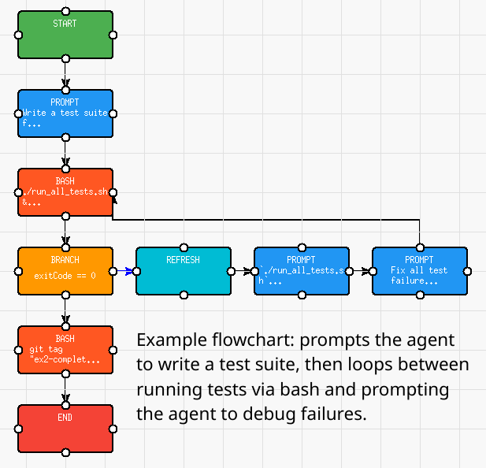

# FlowCoder

Create and execute custom automated workflows for Claude Code and Codex, via a visual flowchart builder.



## Requirements

- Python 3.12+
- [uv](https://docs.astral.sh/uv/)
- Node.js 18+

## Install & Run

```bash
uv sync
npm install
uv run python -m src.main
```

## Quickstart

This repo contains a number of example flowcharts to help users understand the system. It is recommended you understand how they work by reviewing them in the Commands tab later, but right now let's try using them.

1. Go to the Sessions tab, click New Session, enter the name notepad-clone, and choose a fresh working directory. Hit Create Session.

2. In the Chat pane, under where it says "Input:", type `/ex0-design-doc "Make a plain text editor Electron app. It should have all the features that Notepad on Windows 10 has."` and hit enter. This is a very simple flowchart that prompts the agent to make a design doc for the given task, using argument substitution to fill in the prompt. (You can replace the plain text editor task with any other task of your choosing, it's just an example.)

3. The flowchart for that slash command will begin executing. When it finishes, you'll see "Execution completed: ex0-design-do" in the Output section.

4. Next, try `/ex1-do-until-done DESIGN_DOC.md`. This flowchart repeatedly prompts the agent to fully implement the specified design document until the agent is finished. Then the flowchart resets the agent's context, and prompts it to audit the implementation, further looping if the audit uncovers issues.

5. Note that the next couple examples are more time-consuming, as they involve flowcharts built for longer autonomous behavior. Try `/ex2-testing-loop DESIGN_DOC.md`. This is the flowchart from the preceding image: it writes a test suite that fits the design document, then loops between running tests via bash and prompting the agent to diagnose/fix test failures.

6. The final example is `/ex3-improve-project [N]` (replace `[N]` with any number, e.g. `/ex3-improve-project 2`). This example demonstrates for-loop behavior in a flowchart. The flowchart performs N iterations; in each iteration, the flowchart prompts the agent to design a new major feature for the codebase, then runs `/ex1` and `/ex2` for the new feature.

You can also run `/all-examples` to see all four examples executed sequentially.

## Creating Commands

Commands are reusable workflows built from connected blocks in a flowchart. To create a command:

1. Click **New Command** in the Commands tab
2. Give your command a name (alphanumeric, hyphens, and underscores only)
3. Drag blocks from the **Block Palette** onto the canvas
4. Connect blocks by dragging from one block's output port to another's input port (branching special case below)
5. Configure each block by clicking on it and editing its properties

### Block Types

| Block | Purpose |
|-------|---------|
| **Start** | Entry point (required) |
| **Prompt** | Send a prompt to Claude and capture structured output |
| **Bash** | Execute shell commands |
| **Variable** | Set a variable to a value |
| **Branch** | Conditional branching based on variable values |
| **Command** | Invoke another command |
| **Refresh** | Restart the Claude session |
| **Cast** | Convert variable types |
| **End** | Exit point |

### Branch Blocks

Branch blocks evaluate a condition and follow either the **True path** (black arrow) or **False path** (blue arrow).

**Creating connections:**
- **True path**: Drag from a port to create a black arrow
- **False path**: Ctrl+Drag from a port to create a blue arrow

**Condition syntax:**

| Format | Example | Description |
|--------|---------|-------------|
| `field == value` | `status == "done"` | Equality check |
| `field != value` | `count != 0` | Inequality check |
| `field > value` | `score > 80` | Greater than |
| `field < value` | `attempts < 3` | Less than |
| `field >= value` | `progress >= 100` | Greater than or equal |
| `field <= value` | `errors <= 5` | Less than or equal |
| `field` | `isComplete` | Boolean field (truthy check) |
| `!field` | `!hasErrors` | Negated boolean field |

### Variable Substitution

Blocks can reference variables from previous blocks:
- `$1`, `$2`, etc. - Positional arguments passed to the command
- `{{variable_name}}` - Variables set by previous blocks

## Sessions

Sessions are isolated execution environments with their own working directory and Claude instance.
(Multiple sessions at once is currently disabled due to an architectural issue leading to memory leaks.)

### Creating a Session

1. Go to the **Agents** tab
2. Click **New Session**
3. Enter a session name and working directory
4. Optionally configure git remote settings

### How Sessions Work

- Each session has its own working directory where Bash blocks execute
- Sessions maintain separate chat and execution history
- Commands run in the context of the active session
- Session data persists to `~/.flowcoder/sessions.json`

### Executing Commands

1. Select a session to make it active
2. Go to the **Commands** tab
3. Select a command and click **Run** (or use the play button)
4. Watch execution progress in the flowchart canvas
5. View results in the chat panel

## Git Integration

FlowCoder initializes a git repository in each session's working directory and automatically commits changes after each Prompt or Bash block finishes executing. Commits are labeled with the block type and name.

Sessions can optionally be configured with:
- **Git Remote URL**: Configures an `origin` remote for the repository
- **Branch**: Checks out (or creates) a specific branch
- **Auto Push**: Automatically pushes to the remote after each commit

## Troubleshooting

### App crashes with `UnknownLocaleError: unknown locale 'c'`

This occurs on systems where the locale is set to `C` (common in minimal Linux environments, WSL, or Docker). Set a proper locale before running:

```bash
LANG=en_US.UTF-8 uv run python -m src.main
```

To make it permanent, add `export LANG=en_US.UTF-8` to your `~/.bashrc`.
